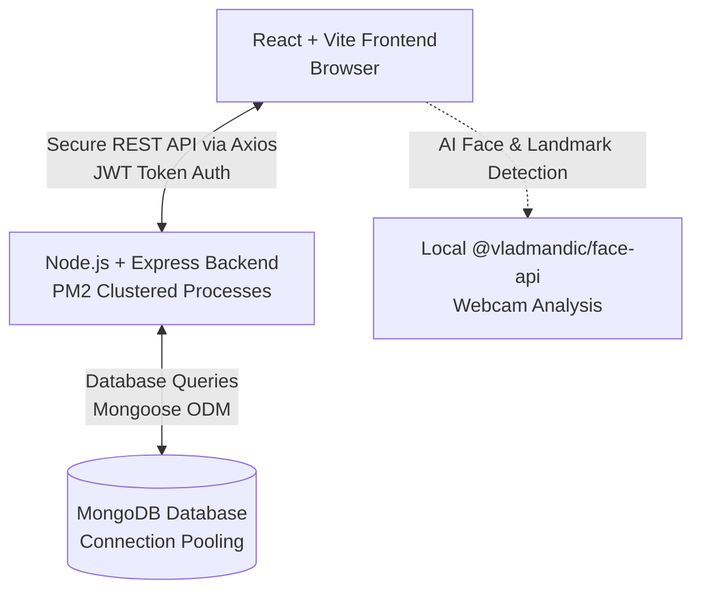
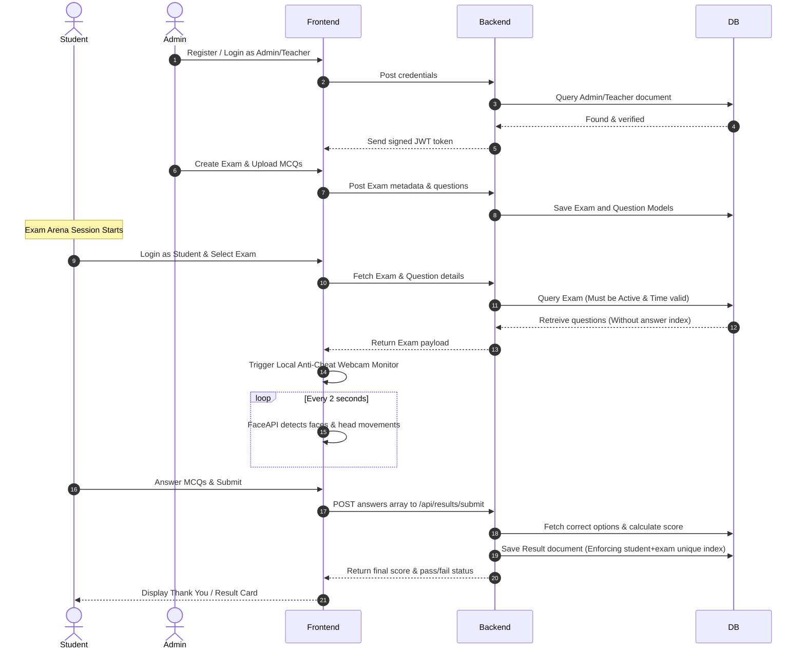
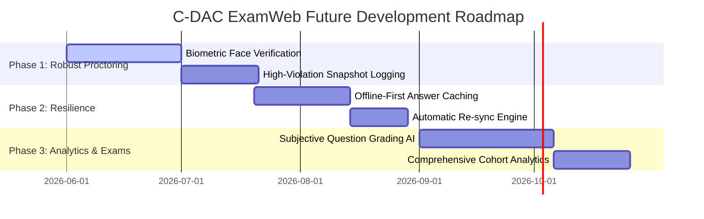

# C-DAC ExamWeb - Comprehensive Tech Stack, Architecture & Scalability Guide

Welcome to the ultimate reference guide for the **C-DAC ExamWeb** online examination platform. This document serves as the "one question file" that thoroughly explains which technology stack is used and where, how the entire platform operates, how many students can simultaneously take an exam, and the future development roadmap.

---

## 1. Complete Technology Stack (Which Used Where)

The application is built using the highly scalable **MERN Stack** (MongoDB, Express, React, Node.js) with production-ready security, compression, process clustering, and client-side machine learning features.

### A. Frontend (Client-Side)
Located in the `client/` directory, the frontend is built using a modern React pipeline.
- **Core Library**: **React (v19)** — Handles high-performance component rendering and local states.
- **Build Tool**: **Vite** — Configured for lightning-fast development, hot module replacement, and highly optimized production bundles.
- **Styling & UI**: **Bootstrap & React-Bootstrap** — Provides responsive grid layouts, forms, navbar headers, and interactive overlays (such as anti-cheat warning modals and confirmation modals).
- **Routing**: **React Router DOM (v7)** — Manages client-side routing, dashboard transitions, and role-based route protection (preventing students from manually entering admin pages).
- **HTTP client**: **Axios** — Communicates with the backend REST API, utilizing request interceptors to automatically attach JWT authorization headers from local storage.
- **AI/ML Security**: **`@vladmandic/face-api`** — A highly optimized browser-side TensorFlow.js implementation that runs local facial detection and landmark tracking directly in the user's web browser, avoiding expensive server-side video processing.

### B. Backend (Server-Side)
Located in the `server/` directory, the backend acts as a stateless RESTful microservice.
- **Runtime Environment**: **Node.js** — Asynchronous, event-driven JavaScript engine built for high-concurrency operations.
- **Web Framework**: **Express.js** — Lightweight server router for defining endpoints, parsing payloads, and running middleware layers.
- **Object Data Modeling (ODM)**: **Mongoose** — Manages database connections, schemas, strict validation rules, and populated references.
- **Authentication**: **JSONWebToken (JWT)** & **BcryptJS** — Handles stateless session tokens and cryptographic password hashing for security.
- **Performance Optimizations**:
  - **`compression`**: Employs Gzip compression middleware to reduce JSON response payload size by up to 70%.
  - **Connection Pooling**: Mongoose is explicitly tuned with `maxPoolSize: 100` to maintain up to 100 concurrent DB sockets.
- **Enterprise Security**:
  - **`helmet`**: Inject security headers (like Content Security Policy, X-Frame-Options) to protect against clickjacking and script injection.
  - **`express-rate-limit`**: Implemented on all `/api` endpoints, capping request throughput to 1,500 requests per 15 minutes per IP address to block brute force and Denial-of-Service (DoS) attacks.
  - **`cors`**: Facilitates secure cross-origin resource sharing, vital for running ngrok development tunnels or hosting the frontend and backend on distinct domains.
- **Process Management**: **PM2** — Utilized via `ecosystem.config.js` to execute Node processes in cluster mode, scaling the server across all available logical CPU cores.

### C. Database Layer
- **MongoDB**: A NoSQL document-store database, perfect for flexible JSON models representing dynamic exams, dynamic questions, and rich exam submission scores.

---

## 2. How the Platform Works (Workflow & Architecture)

The system manages three primary roles: **Student**, **Teacher**, and **Admin**. Here is the detailed step-by-step workflow:

### Step 1: Authentication & Authorization
- A user signs up. By default, their role is set to `student`. An administrator can navigate to `Manage Users` to elevate accounts to `teacher` or `admin`.
- Logins are validated using bcrypt comparison. On success, a JWT is generated. The token is saved in browser storage.
- Protected route wrappers inspect the JWT's payloads before granting entry to specific page views.

### Step 2: Content Creation (Admin / Teacher Dashboard)
- Admins create exams by specifying title, duration (minutes), passing score percentage, default time per question, and a scheduled date and start/end time.
- Questions are added to exams. Questions contain a text block, 4 options (options A, B, C, D), and a 0-indexed correct answer (0, 1, 2, or 3). Question-specific images can be uploaded using the file-selector which are written to the server's local file storage.

### Step 3: Taking an Exam (Student Lockdown Arena)
When a student launches an exam, the browser creates a secure, sandboxed environment:
1. **Camera Permissions**: The system requests permission to access the user's camera.
2. **AI Proctoring Engine**:
   - The **Face API** loads weight files (`tinyFaceDetector` and `faceLandmark68TinyNet`) and analyzes the webcam stream every 2 seconds.
   - **No Face Detection**: If the camera detects zero faces for more than 3 seconds, a warning is triggered.
   - **Multiple Face Detection**: If more than 1 face enters the camera frame (e.g., someone looking over the student's shoulder), a violation is filed.
   - **Head Turn (Looking Away)**: Using 68-point landmarks, the script calculates the ratio of the nose tip relative to the jaw edges. If the ratio exceeds predefined limits (student looking right or left for answers), a warning is logged.
   - **Rapid Movement**: The speed of movement between intervals is calculated. Excessively jerky movement flags a warning.
3. **Environment Restrictions**:
   - **Tab Switching**: Using the browser's Page Visibility API, leaving the tab or minimizing the window registers a violation.
   - **Window Focus Loss**: Clicking onto another monitor or app triggers a blur violation.
   - **Window Resizing**: Shrinking the browser window (to attempt split-screening with a cheat sheet) flags a violation.
   - **Key Blockers**: Right-clicks, copy actions, developer tool commands (`F12`, `Ctrl+U`, `Ctrl+C`, `Ctrl+V`, `Ctrl+A`), and screen capture prints are programmatically disabled.
4. **Auto-Submit Penalty**: The interface displays a warning banner. If the count reaches **5 warnings (`MAX_WARNINGS = 5`)**, a warning block modal is locked on-screen, and the exam is instantly auto-submitted to the server, logging the proctoring report.

### Step 4: Grading & Instant Ranking
- Upon submission, the backend matches the submitted 0-indexed answers against the database.
- It computes correct count, percentage, and compares it to the exam's target passing score.
- The exam result is stored in the database. A compound unique index `student_1_exam_1` prevents duplicate submissions.
- **Dense Ranking**: When teachers view the exam leaderboard, a dense ranking algorithm automatically groups results. Students with identical percentages are assigned the same rank, ensuring fair score-boards.

---

## 3. How Many Students Can Give an Exam at a Time? (Scalability Analysis)

Determining "how many students can give an exam at a time" depends entirely on your hosting environment. Thanks to the highly optimized, non-blocking architecture implemented in this codebase, the platform is designed to scale dynamically.

### A. Local Development / Low-Tier Server (e.g., 1 Core CPU, 1GB-2GB RAM VPS)
- **Supported Concurrency**: **100 to 300 active students simultaneously.**
- **Details**:
  - The local database and single-threaded Node server can easily process simple MCQ selections and periodic auth checks.
  - The AI face-tracking is run locally inside each student's browser rather than the server, preserving 100% of the server's CPU cycles for API responses.

### B. Single Dedicated Server with PM2 Clustered Mode (e.g., 4 Cores CPU, 8GB RAM)
- **Supported Concurrency**: **1,000 to 3,000 active students simultaneously.**
- **Details**:
  - **Process Clustering**: PM2 is configured (`instances: 'max'`) to spin up 4 separate Node worker threads (one for each logical core) in cluster mode, sharing the network port.
  - **Database Conn Pooling**: Mongoose pools up to 100 connections per cluster process, maintaining up to 400 concurrent database connections.
  - **Load Testing Proof**: The project includes `load_test.js` using `k6`, configured to validate high loads of **1,000 virtual users (VUs)** slamming the `/api/exams` endpoint, ensuring transaction response speeds remain well under **500ms**.

### C. Enterprise Multi-Server Cluster (AWS / Google Cloud behind Load Balancers)
- **Supported Concurrency**: **10,000+ active students simultaneously.**
- **Details**:
  - By deploying the stateless Express backend to container services (such as AWS ECS or Kubernetes) behind an Application Load Balancer (ALB), and connecting to a distributed MongoDB Atlas cluster (M30+ tier), the platform can handle tens of thousands of concurrent examinees.

### Core Scaling Optimizations Already in the Code:
1. **No Server-Side Video Processing**: The heavy computational workload of running facial AI is offloaded onto the student's browser, enabling extremely cheap, lightweight backend costs.
2. **Database Indices**: A unique compound index prevents duplicate result entries, avoiding database lockups and race conditions during high-speed auto-submissions.
3. **Data Compression**: Gzip compression is enabled globally via Node.js middleware to minimize network bandwidth consumption.
4. **Connection Caching**: Persistent MongoDB connection pools ensure connection handshakes are not repeated on every API request.

---

## 4. Future Development Planning (Roadmap)

To elevate the C-DAC ExamWeb application into an enterprise-grade academic platform, the following features are planned for future development:

### Phase 1: Biometric Face Matching & Snapshot Logging
*   **Biometric Enrollment**: Implement a feature requiring students to register a profile photo during onboarding. Before starting an exam, the webcam verifies the student's face against their registered profile picture using facial feature vectors to prevent proxy test-takers.
*   **Snapshot Violation Logs**: Instead of merely logging text warnings when a violation occurs (like looking away or detecting multiple faces), the app will take a silent 320x240 webcam snapshot, upload it to a secure cloud storage bucket (e.g., AWS S3), and append the image link directly to the student's violation log. Teachers can then inspect visual proof of the incident.

### Phase 2: Offline-First Resilience
*   **Local Caching (IndexedDB/LocalStorage)**: If a student's internet drops during an exam, the frontend will continue running uninterrupted. Answers will be cached locally in browser storage.
*   **Automatic Syncing**: An background service worker will continually ping the backend. When connectivity is restored, it will seamlessly upload the cached answers to the server without the student experiencing page reloads or data loss.

### Phase 3: Subjective Question Auto-Grading (GenAI Integration)
*   **Short Answer Scoring**: Support text-based question formats (e.g., "Explain the difference between SQL and NoSQL").
*   **LLM API Grading**: Integrate Google's Gemini API to scan the student's text response, cross-reference it with a teacher-supplied rubric, assign an objective score, and draft a brief paragraph of constructive feedback automatically.

### Phase 4: Cohort Performance Analytics & LDAP Integration
*   **Enterprise SSO**: Integrate single sign-on (SSO) using CDAC's LDAP or Active Directory systems, allowing students and staff to log in using their college credentials.
*   **Analytics Dashboard**: Provide rich data visualization charts (using Chart.js or Recharts) showing class performance distributions, standard deviations, average time spent per question, and automatic flagging of "difficult" questions based on high failure rates.

---

## 5. Frequently Asked Questions (Q&A File)

#### Q1: What happens if a student loses internet connection during the exam?
Currently, if the internet connection is lost, API requests to submit answers will fail. The student will need to wait for internet recovery to submit. In our upcoming *Phase 2 Roadmap*, we are adding offline-first support using browser `localStorage` and background synchronization, ensuring no progress is ever lost.

#### Q2: Can students bypass the webcam monitoring by using a virtual camera?
The browser's media navigator allows selecting video sources. While a dedicated student might attempt using software to stream a pre-recorded loop, our *Phase 1 Roadmap* (Biometric Face Matching) will mitigate this by matching the face dynamically against random blink-checks and head movement requirements.

#### Q3: Does the anti-cheat system auto-submit the exam on the very first violation?
No, the system is designed to prevent false positives. It maintains an active count up to **5 warnings (`MAX_WARNINGS = 5`)**. A student receives warnings for minor actions like shifting their posture or glancing away. Only when they hit 5 solid violations does the system lock up and auto-submit.

#### Q4: Why do we use PM2 Cluster Mode?
Node.js runs on a single thread by default. If your server has 8 CPU cores, a default Node app leaves 7 of them completely idle. PM2 Cluster Mode spins up 8 separate instances of our backend server and shares the workload across all 8 cores, multiplying performance and throughput eightfold.

#### Q5: Is MongoDB Atlas suitable for high concurrency?
Yes! MongoDB is a non-blocking, highly concurrent document database. By setting `maxPoolSize: 100` and adding proper indexes on key lookups (like `exam` ID and `student` ID), the database handles thousands of reads and writes per second with ease.

---

*Document prepared for CDAC ExamWeb Development Team - 2026.*
